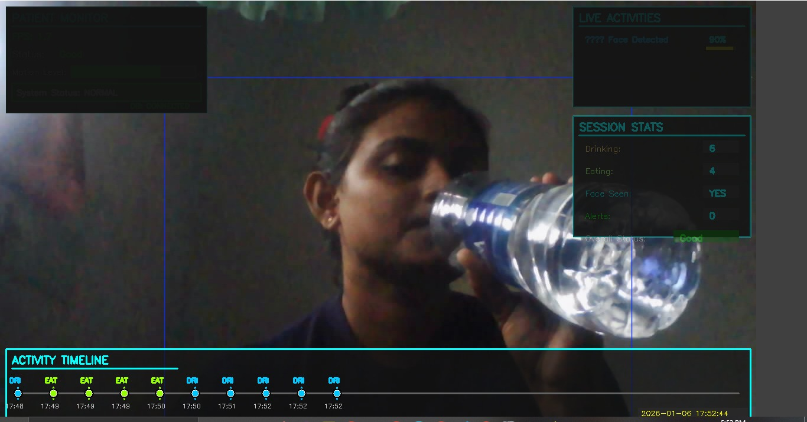
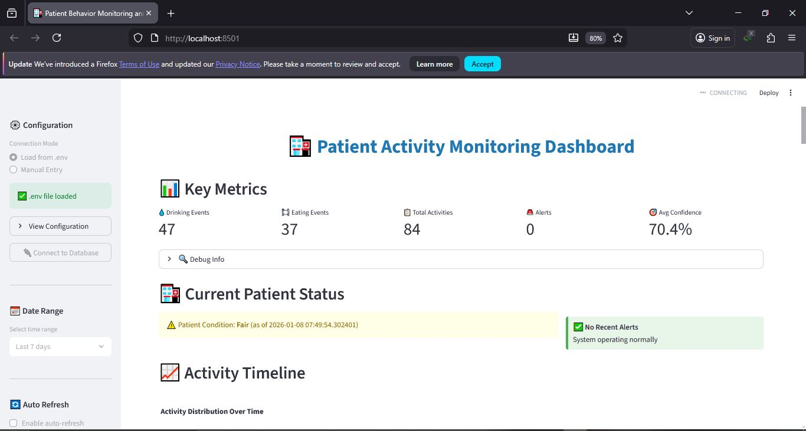
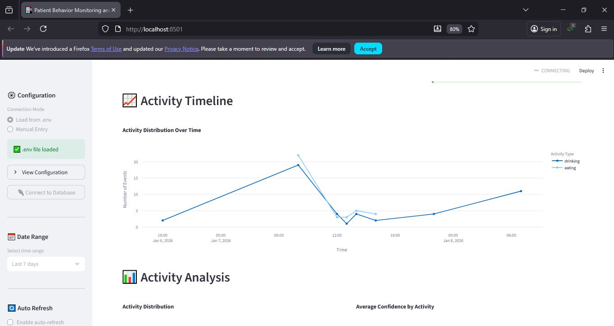
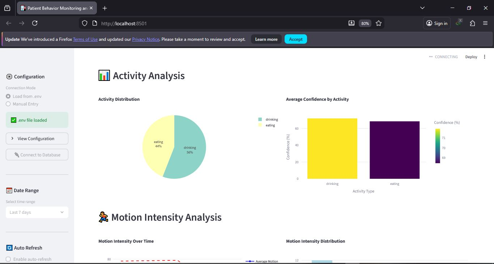
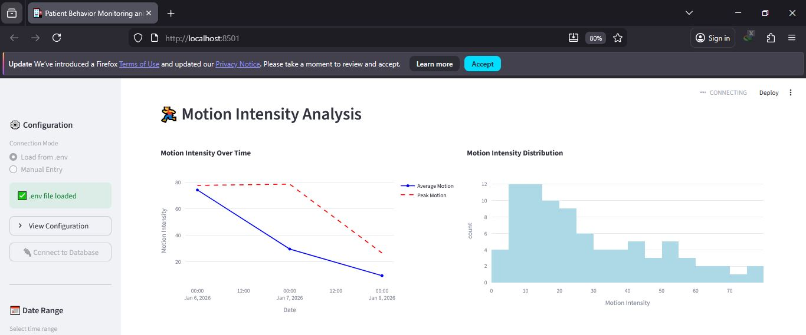
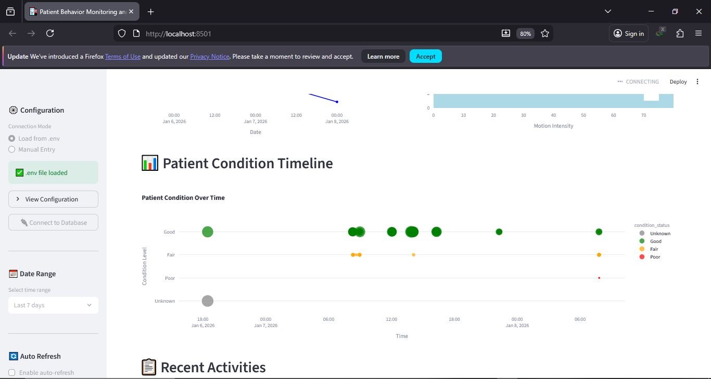
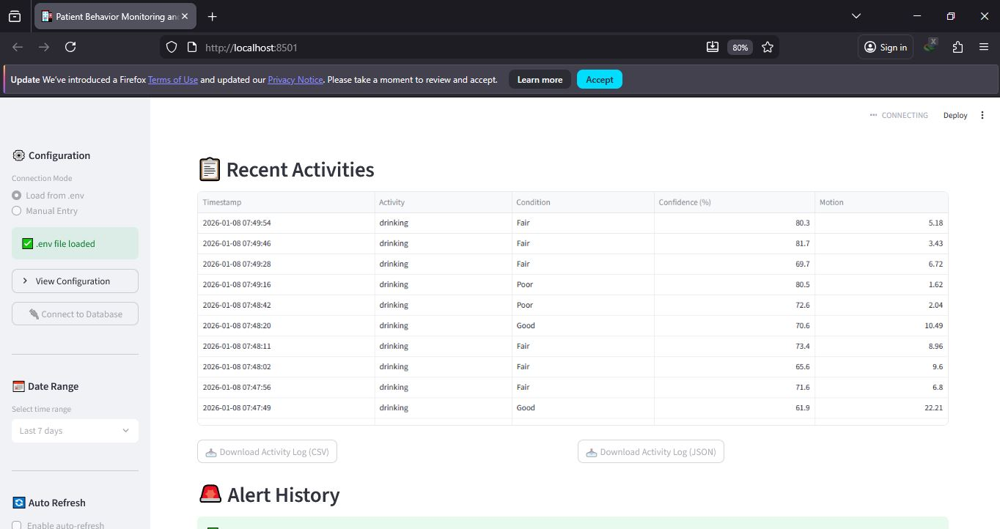
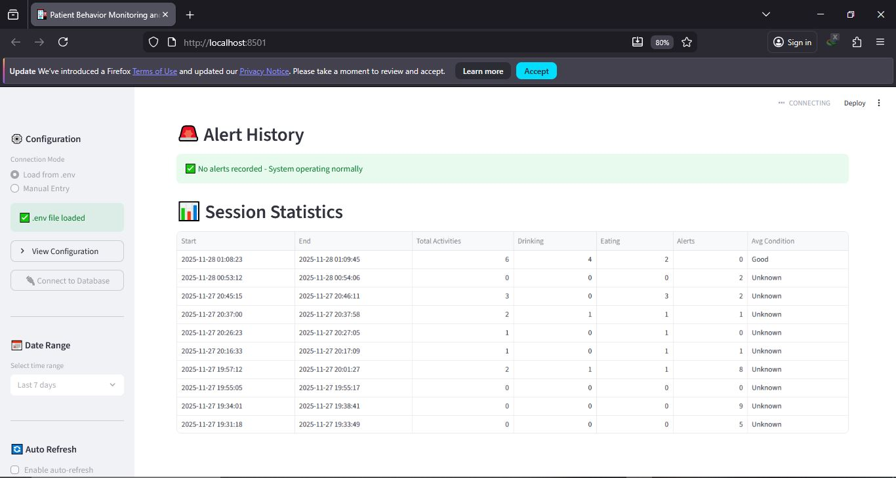

# Behavior-Monitoring-and-Healthcare-Summary
# 🏥 Patient Activity Monitoring System

A real-time patient behavior monitoring system using **YOLO-based object detection**, **OpenCV**, **PostgreSQL**, and **Streamlit** to detect eating, drinking, motion levels, and patient condition.


## 🚀 Features
- Real-time eating & drinking detection
- Motion intensity analysis
- Patient condition monitoring (Good / Fair / Poor)
- Alert generation for inactivity
- PostgreSQL database logging
- Streamlit dashboard for visualization


## 🛠️ Technologies Used
- Python
- YOLO11 (Ultralytics)
- OpenCV
- Streamlit
- PostgreSQL
- NumPy, Pandas, Plotly


## 📁 Project Structure
Patient-Monitoring-System/
- │
- ├── patient_monitoring.py # Main real-time monitoring system
- ├── dashboard.py # Streamlit dashboard
- ├── model_setup.py # YOLO11 model setup & testing
- ├── requirements.txt # Python dependencies
- ├── .env # Database configuration
- └── README.md # Project documentation


## ⚙️ Installation Guide

### 1️⃣ Clone the Repository
```
git clone https://github.com/your-username/your-repo-name.git](https://github.com/ViduniZ/Behavior-Monitoring-Healthcare-Summary.git
cd Behavior-Monitoring-Healthcare-Summary

```

### 2️⃣ Create Virtual Environment
```
python -m venv venv
source venv/bin/activate   # Linux / Mac
venv\Scripts\activate      # Windows
```
3️⃣ Install Dependencies
```
pip install -r requirements.txt

```
🔐 Environment Configuration
```
DB_HOST=localhost
DB_PORT=5432
DB_NAME=patient_monitoring
DB_USER=postgres
DB_PASSWORD=********


```
▶️ How to Run the System
🧪 Setup YOLO11 Model
```
python model_setup.py

```
Recommended model: YOLO11 Nano (yolo11n.pt)

📹 Start Patient Monitoring

```
python patient_monitoring.py

```

Controls:

- Q – Quit
- R – Start/Stop recording
- S – Save screenshot
- A – Trigger manual alert

📊 Launch Dashboard
```
streamlit run dashboard.py
```
The dashboard shows:

- Activity logs
- Alerts
- Motion statistics
- Patient condition timeline
- Confidence levels


🖥️ System Requirements

- Python 3.9+
- Webcam or IP Camera
- CPU (GPU optional)
- PostgreSQL Database

Optimized for low-resource systems (CPU-based real-time inference)


🎯 Use Case

- Hospital patient monitoring
- Elderly care
- Remote healthcare assistance
- Academic and research projects


📈 Design Excellence

- Lightweight YOLO11 Nano model
- Real-time inference without GPU
- Modular architecture
- Database-backed analytics
- User-friendly dashboard interface


📜 License

This project is intended for academic and research purposes only.


🙌 Acknowledgements

- Ultralytics YOLO
- OpenCV Community
- Streamlit Team
- PostgreSQL

## 📸 Screenshots

### 🧠 Real-Time Patient Monitoring
Displays live video feed with YOLO-based detections, motion level, patient condition, and alerts.



---

### 📊 Streamlit Dashboard
Interactive dashboard showing activity logs, alerts, confidence levels, and patient condition over time.



---



---



---



---



---



---



---

---


